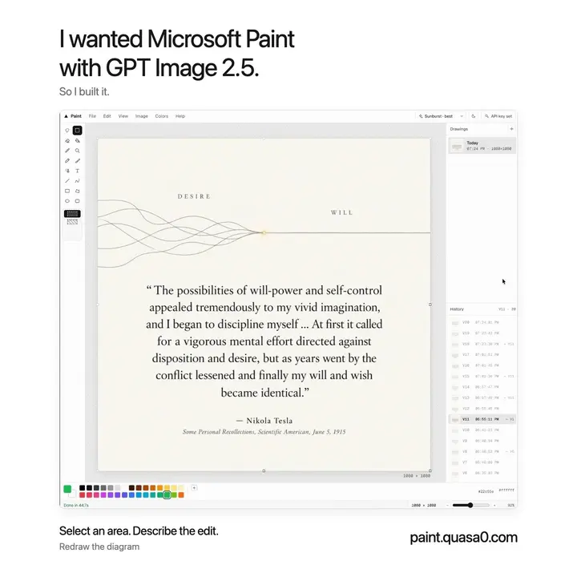

# Paint

I wanted Microsoft Paint with GPT Image 2.5. So I built it.

Draw, select an area, and describe the edit. Paint puts the result back into your canvas, inside your selection.

**[Open Paint →](https://paint.quasa0.com/app/)** · [Run locally](#run-locally) · [Contribute](CONTRIBUTING.md) · [MIT license](LICENSE)



## A paint app, with AI where you need it

- **Edit a selection.** Use a rectangle or free-form lasso, then tell GPT Image 2.5 what to change. Choose Flare or Sunburst and set the output quality.
- **Keep drawing while edits run.** Start separate AI jobs on different parts of the canvas. Each job has its own progress and cancel control.
- **Use the familiar tools.** Pencil, brushes, eraser, fill, eyedropper, text, lines, curves, and shapes. Move, resize, rotate, flip, or duplicate selections.
- **Go back to any version.** Drawings autosave in your browser. Each drawing keeps branching history, so an edit after Undo does not erase the other branch.
- **Work with your images.** Open, drop, or paste an image; export PNG, PNG at 2×, JPEG, WebP, or just the selection. Light and dark themes, custom colors, snapping, pan, and zoom are built in.

## Try an AI edit

1. Open an image or draw something.
2. Select an area with the rectangle or lasso tool.
3. Sign in with OpenAI (uses your ChatGPT plan) or add your own API key, then enter a prompt, such as “Make this chart more impressive.”
4. Generate. Continue working elsewhere while the edit runs, or undo the result if you prefer the original.

### Share your ChatGPT plan

Signed in with OpenAI? Open the account dialog (the button in the top right) and choose **Create share link**. Anyone who opens that link runs AI edits on your plan without signing in; they never see your account. The link expires after the period you pick (1 to 90 days), is limited to 40 edits per 10 minutes, and you can revoke it at any time or by signing out. Guests keep drawing normally and see whose account they are using.

By default, the model receives the selection's bounding rectangle. **Image → AI sees surroundings too** includes nearby pixels for context. For a lasso, the request can include pixels outside its outline but inside that rectangle; Paint clips the returned patch to the lasso. Pixels outside the selection stay unchanged.

<details>
<summary>See the dark theme</summary>


</details>

## Run locally

Use Node.js 24 LTS and npm. `.nvmrc` selects the same Node version as CI.

```sh
git clone https://github.com/quasa0/paint.quasa0.com.git
cd paint.quasa0.com
npm ci
npm run dev
```

Open the local URL printed by Vite. Drawing tools work without an account. AI edits need either an OpenAI sign-in (ChatGPT Plus, Pro or Team) or an API key with access to the image models. The sign-in path is relayed by the Vercel function in `api/codex-images.ts`, which the dev server also runs.

| Command | Purpose |
| --- | --- |
| `npm run dev` | Start the local Vite server |
| `npm run lint` | Check the code with Oxlint |
| `npm run build` | Type-check and build the static app into `dist/` |
| `npm run preview` | Preview the production build locally |

To host your own copy, deploy to Vercel (the `api/` functions relay sign-in requests) or serve `dist/` from a static host with the API-key path only. No server-side key is required; each visitor brings their own account.

Share links need a Redis store: attach Upstash Redis to the Vercel project (or set `KV_REST_API_URL` and `KV_REST_API_TOKEN`). Without it, `/api/share` answers 503 and everything else keeps working. The dev server keeps share links in memory.

## Your images and API key

Paint stores drawings and their version history in IndexedDB. It stores settings, your API key and sign-in tokens in localStorage, with an IndexedDB copy. This storage belongs to the browser and site you use; clearing site data removes it. Export files you want to keep.

AI requests go directly from your browser to OpenAI's [image edits API](https://developers.openai.com/api/docs/guides/image-generation). Paint has no backend that collects your key or drawings. The one exception is a share link you create: your OpenAI sign-in tokens are then stored server-side under a random id until the link expires or you revoke it, so that guests' edits can run on your plan. AI edits send your prompt and the image region described above to OpenAI, and OpenAI bills your account. The browser stores the key as readable text, so use the app only on devices and deployments you trust.

## Code map

React and TypeScript provide the interface; Canvas 2D handles pixels. Vite builds the static app.

| Location | Responsibility |
| --- | --- |
| `src/paint/editor.ts` | Tools, selections, editor state, and concurrent AI jobs |
| `src/paint/ai.ts` | Image request preparation, OpenAI calls, and result placement |
| `src/paint/oauth.ts` and `share.ts` | OpenAI sign-in and share links (client side) |
| `api/` | Vercel functions: the sign-in relay and share-link storage |
| `src/paint/doc.ts` and `draw.ts` | Canvas operations and drawing primitives |
| `src/paint/library.ts` | Browser database, saved drawings, and versions |
| `src/components/` | Menus, workspace, palette, dialogs, and sidebars |

Bug reports and focused pull requests are welcome. See [CONTRIBUTING.md](CONTRIBUTING.md) for checks and useful reproduction details.

## License

[MIT](LICENSE). Built by [Anatolii / quasa0](https://github.com/quasa0).
